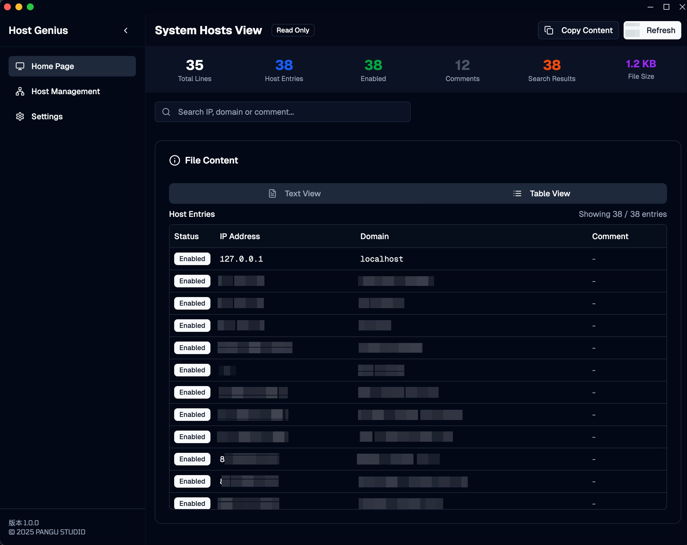
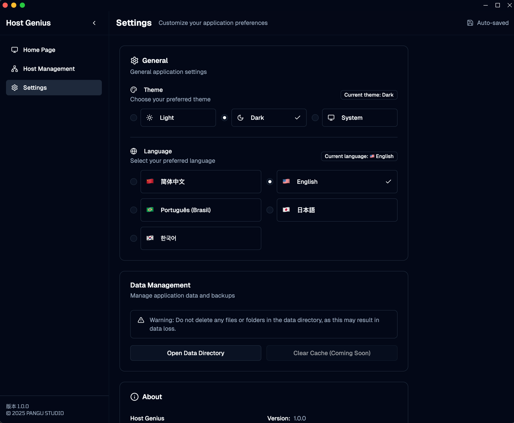

# Host Genius

🎉 **We're excited to announce the first stable release of Host Genius!**

Host Genius is a powerful and user-friendly hosts file management tool that makes managing your system's hosts configuration effortless. Built with modern technologies and designed for cross-platform compatibility.

## ✨ Key Features

### 🗂️ **Group Management**
- **Create and organize host groups**: Categorize your hosts configurations for better organization
- **Enable/disable groups**: Easily toggle entire groups on or off without losing your configurations
- **Rich metadata**: Add descriptions and track creation/modification dates for each group

### 🔧 **Advanced Host Management**
- **Intelligent parsing**: Automatically parse and validate hosts file entries
- **Real-time preview**: See exactly how your changes will affect the system
- **Content validation**: Built-in validation to prevent malformed entries
- **Bulk operations**: Import, export, and manage multiple host entries efficiently

### 🔄 **Import/Export Capabilities**
- **SwitchHosts compatibility**: Seamlessly import configurations from SwitchHosts
- **Flexible export options**: Export individual groups or entire configurations
- **Multiple format support**: Compatible with various hosts file formats

### 🔒 **System Integration**
- **Secure system access**: Intelligent permission handling for system hosts file modifications
- **Automatic backups**: Create automatic backups before any system changes
- **DNS cache management**: Automatically flush DNS cache after applying changes
- **Cross-platform support**: Works seamlessly on Windows, macOS, and Linux

### 📊 **System Hosts Viewer**
- **Dual view modes**: Switch between text and table views for better readability
- **Advanced search**: Search through IP addresses, domains, and comments
- **Real-time statistics**: View file statistics including total lines, host entries, and more
- **Read-only safety**: Safe viewing of system hosts without accidental modifications

### 🎨 **Modern User Experience**
- **Clean interface**: Intuitive and modern UI built with React and Tailwind CSS
- **Dark/Light themes**: Choose your preferred theme or follow system settings
- **Multi-language support**: Available in English, Chinese (Simplified), Portuguese, Japanese, and Korean
- **Responsive design**: Optimized for different screen sizes and resolutions

### 💾 **Data Management**
- **Local storage**: All data stored locally for privacy and security
- **Backup system**: Comprehensive backup and restore functionality
- **Version history**: Track changes with built-in version control
- **Data portability**: Easy data export and import for migration

## 🚀 **Getting Started**

1. **Download** Host Genius from the releases page
2. **Install** the application on your system
3. **Launch** and start creating your first host group
4. **Apply** your configurations to the system with one click

## 🛠️ **Technical Highlights**

- **Built with Electron**: Native desktop experience across platforms
- **React + TypeScript**: Modern, type-safe frontend development
- **SQLite database**: Reliable local data storage
- **Secure system operations**: Safe handling of system-level file modifications

## 🔮 **What's Next?**

We're already working on exciting features for future releases:
- Cloud synchronization capabilities
- Advanced rule templates
- Plugin system for extensibility
- Enhanced import/export formats

## 🐛 **Known Issues**

- On some Linux distributions, you may need to run the application with elevated privileges for system hosts modifications
- Large hosts files (>10MB) may experience slower parsing performance

## 🙏 **Acknowledgments**

Special thanks to our beta testers and the open-source community for their valuable feedback and contributions.

## 📞 **Support**

- **Documentation**: Check our comprehensive user guide
- **Issues**: Report bugs or request features on our GitHub repository
- **Community**: Join our discussions for tips and best practices

---

**Download Host Genius 1.0.0 today and take control of your hosts configuration!**

*Host Genius is developed by Pangu Studio with ❤️*
